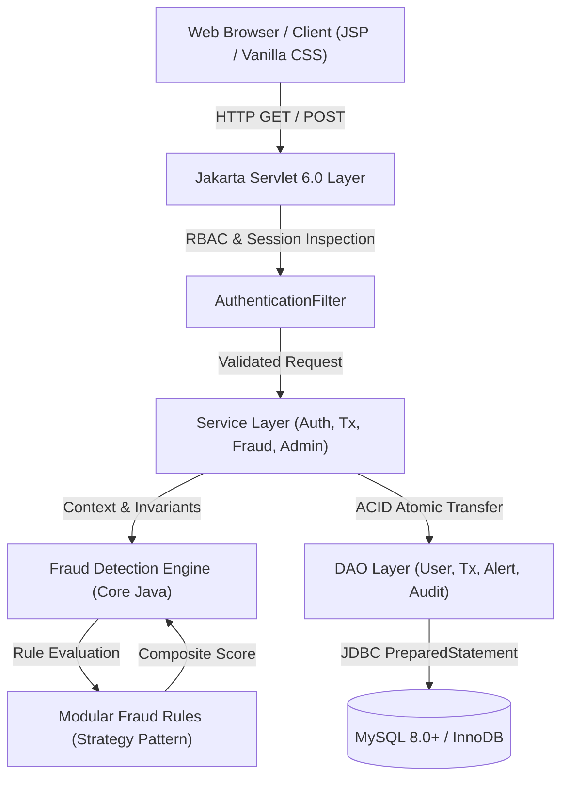
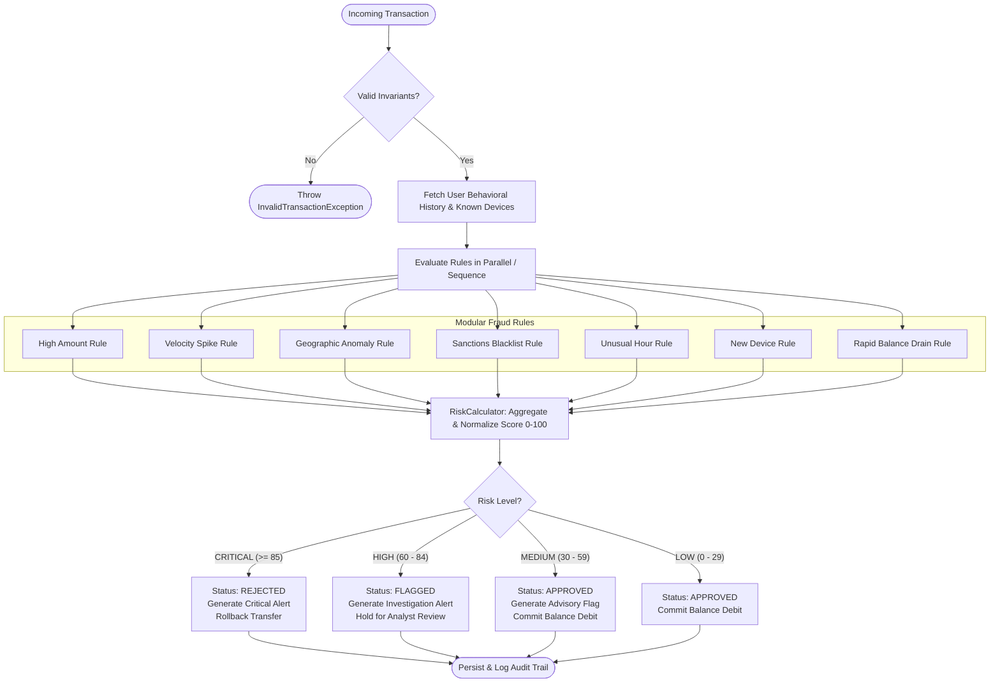
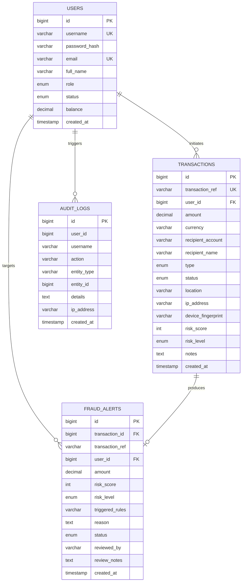
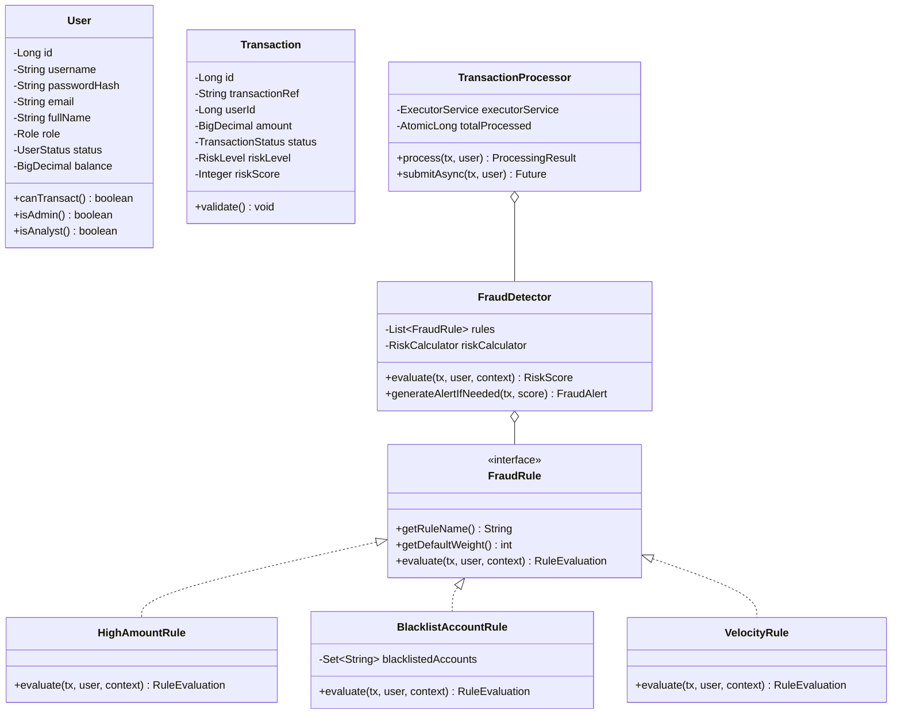

# FraudGuard — AI-Powered Fraud Detection System

[](https://adoptium.net/)
[](https://maven.apache.org/)
[](https://tomcat.apache.org/)
[](https://jakarta.ee/)
[](https://www.mysql.com/)
[](LICENSE)

An enterprise-grade, real-time financial fraud detection and risk scoring engine built from the ground up using **Core Java**, **Jakarta Servlet 6.0**, **JDBC**, **MySQL**, and **Vanilla CSS**. Designed for high-throughput anomaly evaluation, ACID transaction integrity, and educational viva demonstration.

---

## 1. Problem Statement & Objectives

Modern digital payment networks process billions of financial events daily. Financial institutions face mounting threats from account takeovers, bot testing, impossible physical travel, sanctions evasion, and rapid balance liquidation. 

### Key Objectives
1. **Millisecond Anomaly Detection**: Evaluate incoming transactions across 7 modular behavioral rules in real time.
2. **ACID Financial Integrity**: Ensure atomic balance debits, credits, and transaction logging with automatic rollback on error.
3. **Role-Based Access Control**: Provide distinct, secured operational experiences for Customers, Fraud Analysts, and System Administrators.
4. **Viva-First Design**: Codebase structured specifically to demonstrate Core Java OOP, Collections, Multithreading, JDBC, and Servlets during academic evaluations.

---

## 2. System Architecture



---

## 3. Fraud Detection Flowchart



---

## 4. Entity-Relationship (ER) Diagram



---

## 5. Class Diagram



---

## 6. Pre-Configured Demonstration Accounts

| Role | Username | Password | Purpose | Initial Balance |
|---|---|---|---|---|
| **System Administrator** | `admin` | `Admin@123` | Executive KPI analytics, user status changes, audit logs | $0.00 |
| **Fraud Analyst** | `analyst` | `Analyst@123` | Alert investigation triage, incident resolution | $0.00 |
| **Customer** | `john_doe` | `Customer@123` | Primary demonstration account for submitting transfers | $25,000.00 |
| **Customer** | `jane_smith` | `Customer@123` | Secondary customer account | $15,400.00 |
| **Customer** | `bob_taylor` | `Customer@123` | High-risk customer profile | $4,800.00 |

---

## 7. Installation & Running Instructions

### 7.1 Prerequisites
- **Java Development Kit (JDK)**: OpenJDK 25 LTS (or JDK 17+)
- **Build Tool**: Apache Maven 3.9+
- **Application Server**: Apache Tomcat 10.1.x (Jakarta EE 10 / Servlet 6.0 compatible)
- **Database**: MySQL 8.0+

### 7.2 Database Setup
1. Open your MySQL client or terminal:
   ```bash
   mysql -u root -p
   ```
2. Execute the schema script:
   ```sql
   SOURCE database/schema.sql;
   ```
3. Seed test records and initial accounts:
   ```sql
   SOURCE database/seed.sql;
   ```

### 7.3 Database Configuration
Copy the template configuration in `src/main/resources/db.properties.example` to `src/main/resources/db.properties`:
```properties
db.driver=com.mysql.cj.jdbc.Driver
db.url=jdbc:mysql://localhost:3306/fraudguard_db?useSSL=false&allowPublicKeyRetrieval=true&serverTimezone=UTC
db.user=root
db.password=your_password
```
*(Alternatively, configure environment variables `DB_URL`, `DB_USER`, `DB_PASSWORD`)*

### 7.4 Building the Application
Run Maven to compile, execute all unit and integration test suites, and package the WAR:
```bash
mvn clean package
```
This generates:
```
target/fraudguard.war
```

### 7.5 Deployment to Apache Tomcat 10
1. Copy `target/fraudguard.war` to your Tomcat `webapps/` folder:
   ```bash
   cp target/fraudguard.war $CATALINA_HOME/webapps/
   ```
2. Start Tomcat:
   - **Linux / macOS**: `$CATALINA_HOME/bin/startup.sh`
   - **Windows**: `$CATALINA_HOME\bin\startup.bat`
3. Access FraudGuard in your browser:
   ```
   http://localhost:8080/fraudguard/
   ```

---

## 8. Automated Testing & Verification

The test suite runs 36 tests across 5 test suites with zero external dependencies (backed by in-memory H2 in MySQL compatibility mode):

```bash
mvn clean test
```

### Test Coverage Highlights:
- **`ModelTest`**: Validates encapsulation, role privileges, domain invariants, and risk score aggregation.
- **`FraudDetectionEngineTest`**: Evaluates individual rules (High Amount, Velocity bursts, Impossible Travel, Blacklists, Unusual Hours, Balance Drain) and multithreaded concurrency.
- **`SecurityUtilTest`**: Verifies salted SHA-256 cryptographic hashing and XSS sanitation.
- **`JdbcDaoTest`**: Validates CRUD and atomic ACID transaction rollbacks on insufficient funds.
- **`ServiceLayerTest`**: Tests business orchestration and service isolation.
- **`FullPipelineIntegrationTest`**: End-to-end customer registration, transaction scoring, alert triage, and score boundary tests.

---

## 9. Viva Explanation & Source Code Sitemap

For in-depth explanations of every Core Java, JDBC, and Servlet concept used throughout the project, refer to:
[docs/IMPLEMENTATION_SUMMARY.md](docs/IMPLEMENTATION_SUMMARY.md)
