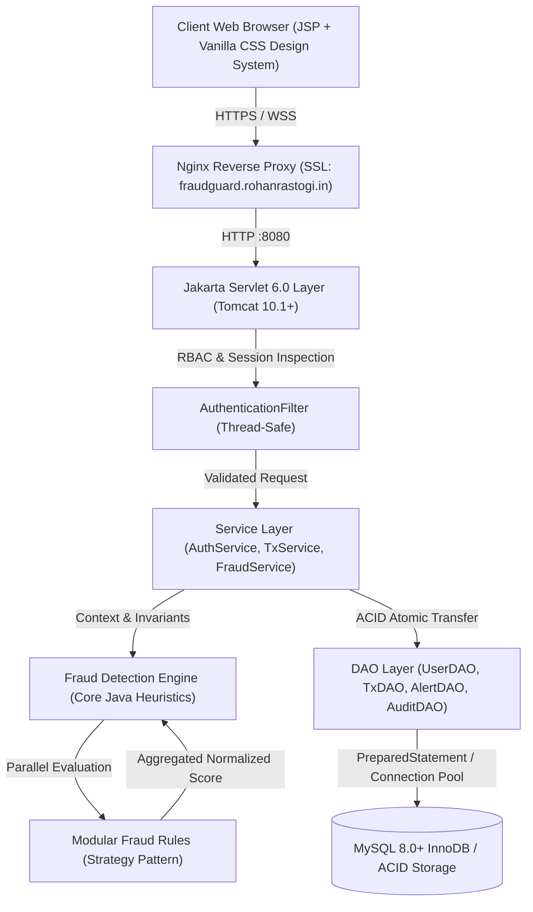
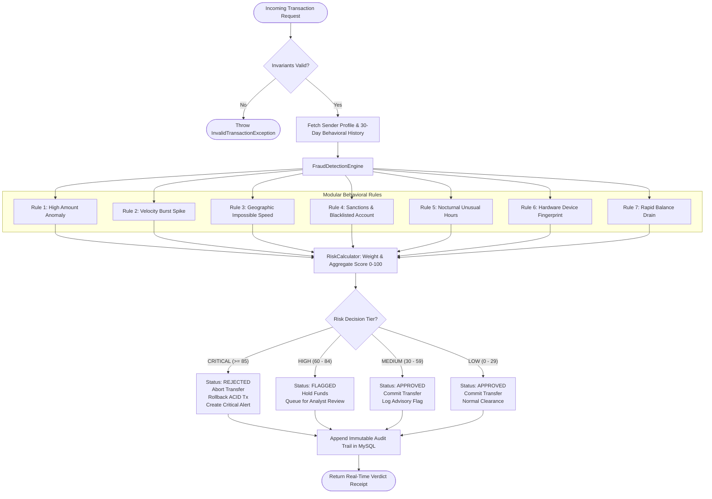
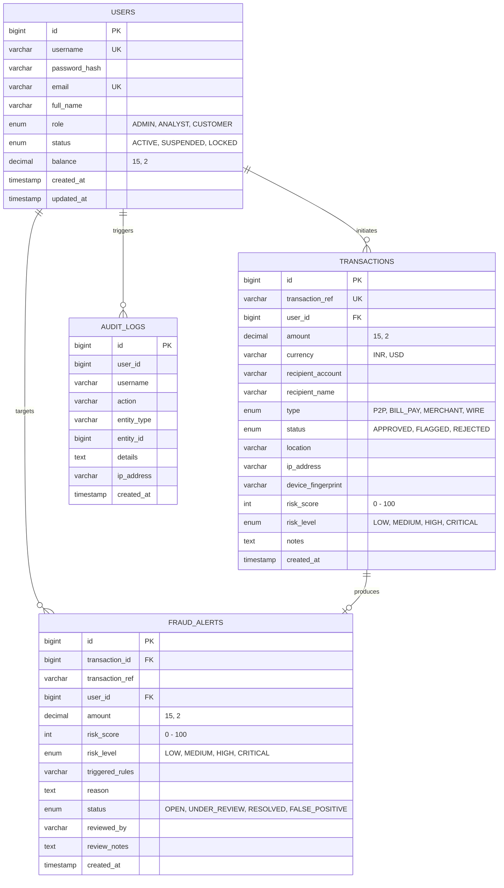

# FraudGuard — AI-Powered Fraud Detection System

> **🌐 Live Application URL**: [https://fraudguard.rohanrastogi.in](https://fraudguard.rohanrastogi.in)  
> **📦 Official GitHub Repository**: [https://github.com/RohanRastogi1/FRAUDGUARD-AI-Powered-Fraud-Detection-System](https://github.com/RohanRastogi1/FRAUDGUARD-AI-Powered-Fraud-Detection-System)  
> **📘 Complete User Guide**: [docs/USER_GUIDE.md](docs/USER_GUIDE.md) &bull; **💾 Database Architecture**: [docs/DATABASE_DESIGN.md](docs/DATABASE_DESIGN.md) &bull; **🎓 Viva Summary**: [docs/IMPLEMENTATION_SUMMARY.md](docs/IMPLEMENTATION_SUMMARY.md)

---

[](https://fraudguard.rohanrastogi.in)
[](https://github.com/RohanRastogi1/FRAUDGUARD-AI-Powered-Fraud-Detection-System)
[](https://adoptium.net/)
[](https://jakarta.ee/)
[](https://tomcat.apache.org/)
[](https://www.mysql.com/)
[](LICENSE)

---

## 1. Executive Summary

**FraudGuard** is an enterprise-grade financial fraud intelligence and autonomous risk-decisioning platform engineered from the ground up using **Core Java**, **Jakarta Servlet 6.0**, **JDBC**, **MySQL 8.0**, and **Vanilla CSS**. 

Designed to process digital transactions with sub-10ms latency, FraudGuard executes multi-layered behavioral heuristic rules, preserves strict ACID financial atomicity, and provides complete explainability for compliance auditing, risk analysts, and executive teams.

### Core Value Proposition
- **⚡ Real-Time Anomaly Scoring**: Evaluates incoming transactions against 7 behavioral heuristics in parallel before funds are moved.
- **🛡️ ACID Financial Integrity**: Atomic balance debits and credits with automatic transactional rollback upon anomaly detection.
- **🔐 Multi-Role RBAC**: Tailored experiences for Customers, Fraud Analysts, and System Administrators.
- **💎 Enterprise Financial Interface**: Custom Vanilla CSS design system featuring WCAG high-contrast Light Mode, Obsidian Dark Mode, glowing border accents, and fully responsive mobile drawer navigation.
- **🎓 Viva & Academic Excellence**: Purpose-built to demonstrate Core Java OOP, multithreading (`ExecutorService`), thread-safe collections, JDBC connection pooling, and Servlet lifecycles.

---

## 2. System Architecture



---

## 3. Fraud Detection Engine Pipeline



---

## 4. Behavioral Rule Matrix & Scoring Weights

| Rule Name | Technical Identifier | Default Weight | Trigger Condition | Anomaly Action |
|---|---|---|---|---|
| **High Amount Rule** | `HIGH_AMOUNT` | 45 | Transfer $> ₹1,00,000$ (or $> 3\times$ customer average) | Escalates risk to High |
| **Velocity Spike Rule** | `VELOCITY_BURST` | 35 | $> 3$ transactions initiated within 5 minutes | Flags bot / automated testing |
| **Geographic Anomaly** | `GEOGRAPHIC_ANOMALY` | 50 | Consecutive locations require transit speed $> 800\text{ km/h}$ | Impossible physical travel flag |
| **Sanctions & Blacklist** | `SANCTIONS_BLACKLIST` | 100 | Recipient account listed on international sanctions | Immediate rejection & abort |
| **Unusual Hours Rule** | `UNUSUAL_HOURS` | 20 | Transfer executed between 01:00 AM and 05:00 AM | Nocturnal behavioral variance flag |
| **New Device Anomaly** | `NEW_DEVICE` | 25 | Unrecognized user-agent / device fingerprint hash | Account takeover advisory flag |
| **Rapid Balance Drain** | `RAPID_DRAIN` | 40 | Transfer drains $> 80\%$ of balance in single transfer / 1 hour | Liquidity liquidation flag |

---

## 5. Entity-Relationship (ER) Schema



---

## 6. Pre-Configured Demonstration Personas

For instant demonstration and viva testing, the platform includes pre-seeded accounts accessible via **One-Click Demo Fill** on the login page:

| Persona | Role | Username | Password | Purpose & Capabilities | Initial Balance |
|---|---|---|---|---|---|
| **SuperAdmin** | `ADMIN` | `admin` | `password` | Executive KPI analytics, user status changes, global transaction monitor, immutable audit logs | $0.00 |
| **Fraud Analyst** | `ANALYST` | `analyst` | `password` | Alert triage queue, rule inspection, investigative resolution (Approve vs Reject) | $0.00 |
| **John Doe** | `CUSTOMER` | `john_doe` | `password` | High-volume primary customer with rich 30-day baseline history | **₹2,50,000.00** |
| **Jane Smith** | `CUSTOMER` | `jane_smith` | `password` | Moderate-activity customer profile | **₹1,50,000.00** |
| **Bob Taylor** | `CUSTOMER` | `bob_taylor` | `password` | High-risk customer profile used for rapid drain & velocity demonstrations | **₹50,000.00** |

---

## 7. Quick Start & Local Installation

### 7.1 Prerequisites
- **Java**: OpenJDK 21 LTS or 25 LTS
- **Build Tool**: Apache Maven 3.9+
- **Application Server**: Apache Tomcat 10.1+ (Jakarta Servlet 6.0 compatible)
- **Database**: MySQL 8.0+

### 7.2 Automated Windows Quickstart
If running on Windows, FraudGuard includes ready-to-run automation scripts:
```cmd
:: Start Tomcat & launch FraudGuard
start.bat

:: Stop Tomcat server
stop.bat

:: Restart Tomcat and reload webapp
restart.bat
```

### 7.3 Manual Database Setup
1. Launch MySQL CLI:
   ```bash
   mysql -u root -p
   ```
2. Execute schema and seed data scripts:
   ```sql
   SOURCE database/schema.sql;
   SOURCE database/seed.sql;
   ```
3. Configure connection credentials in `src/main/resources/db.properties` (or copy from `db.properties.example`):
   ```properties
   db.driver=com.mysql.cj.jdbc.Driver
   db.url=jdbc:mysql://localhost:3306/fraudguard_db?useSSL=false&allowPublicKeyRetrieval=true&serverTimezone=UTC
   db.user=root
   db.password=your_mysql_password
   ```

### 7.4 Maven Build & Packaging
Compile, run all 36 test suites, and generate the deployable WAR:
```bash
mvn clean package
```
Generates: `target/fraudguard.war`.

### 7.5 Deploy to Apache Tomcat 10
Copy the generated WAR file into your Tomcat `webapps/` folder:
```bash
cp target/fraudguard.war $CATALINA_HOME/webapps/
```
Start Tomcat and access the application at:
```
http://localhost:8080/fraudguard/
```

---

## 8. Automated Test Suite

FraudGuard includes automated unit and integration tests executing with zero external dependencies (powered by in-memory H2 in MySQL mode):

```bash
mvn clean test
```

| Test Class | Focus Area | What It Validates |
|---|---|---|
| **`ModelTest`** | Domain Models & OOP | Encapsulation, risk level boundaries, RBAC role methods, invariant checks |
| **`FraudDetectionEngineTest`** | Detection Core | Evaluation of all 7 rules, multithreaded `ExecutorService` safety, scoring accuracy |
| **`SecurityUtilTest`** | Cryptography | Salted SHA-256 password hashing, XSS HTML sanitization |
| **`JdbcDaoTest`** | Persistence & ACID | CRUD persistence, PreparedStatement safety, atomic balance rollback on failure |
| **`ServiceLayerTest`** | Business Orchestration | Authentication isolation, transaction authorization, rule integration |
| **`FullPipelineIntegrationTest`** | End-to-End | Registration &rarr; Send Funds &rarr; Heuristic Scoring &rarr; Alert Triage |

---

## 9. Project Directory Layout

```
FRAUDGUARD — AI-Powered Fraud Detection System/
├── database/
│   ├── schema.sql                     # Normalized DDL tables & indexes
│   └── seed.sql                       # Demonstration accounts & Indian INR data
├── docs/
│   ├── USER_GUIDE.md                  # Comprehensive user manual & rule testing
│   ├── DATABASE_DESIGN.md             # Schema architecture & index strategy
│   └── IMPLEMENTATION_SUMMARY.md      # Core Java & Servlet viva technical notes
├── src/
│   ├── main/
│   │   ├── java/com/fraudguard/
│   │   │   ├── dao/                   # JDBC Data Access Objects & Interfaces
│   │   │   ├── exception/             # Custom exception hierarchy
│   │   │   ├── filter/                # Authentication & RBAC Filters
│   │   │   ├── fraud/                 # Engine, Rule Strategy, & Risk Calculator
│   │   │   ├── model/                 # Domain Entities & Enums
│   │   │   ├── service/               # Business Service Layer
│   │   │   ├── servlet/               # Jakarta Servlets (Controllers)
│   │   │   └── util/                  # Connection pooling, security & hashing
│   │   ├── resources/
│   │   │   ├── db.properties.example  # Production database template
│   │   │   └── db.properties          # Local database credentials (gitignored)
│   │   └── webapp/
│   │       ├── css/style.css          # Enterprise Vanilla CSS design system
│   │       ├── WEB-INF/web.xml        # Servlet 6.0 deployment descriptor
│   │       └── views/                 # JSP views (Dashboard, Alerts, History, etc.)
├── pom.xml                            # Maven dependencies & build configuration
├── start.bat                          # One-click Windows deployment script
├── stop.bat                           # Tomcat shutdown script
├── restart.bat                        # Fast recompile & redeploy script
└── README.md                          # Executive project documentation
```

---

## 10. Engineering Team — TeamRootOps

Built by **TeamRootOps** &bull; School of Computing Science and Engineering (SCSE), Galgotias University:
- **Rohan Rastogi** — Team Leader (`ADMIN`) &bull; Lead System Architect & Backend Engineer
- **Anant Kumar** — Team Member &bull; Core Java & Anomaly Detection Specialist
- **Kumar Arya** — Team Member &bull; Database Architecture & ACID Transactions Specialist
- **Rohan Tevatia** — Team Member &bull; Frontend Design System & Web Integration Engineer

---

## 11. License

This project is licensed under the **MIT License** — see the [LICENSE](LICENSE) file for details.

*Secure. Autonomous. Real-Time. Powered by FraudGuard AI.*
