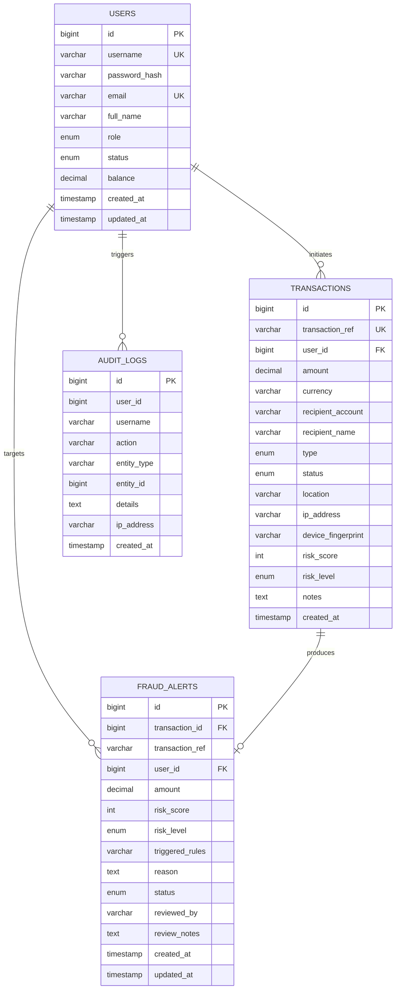

# FraudGuard — Database Architecture & Relational Schema Design

## 1. Overview
The **FraudGuard** database architecture is designed for high-throughput, low-latency, ACID-compliant financial transaction evaluation.
All statistics, metrics, transactions, security alerts, and audit entries are persisted in a normalized relational structure powered by **MySQL 8.0+** using the **InnoDB** storage engine.

---

## 2. Entity-Relationship Overview

---

## 3. Table Specifications

### 3.1 `users` Table
Stores user credentials, role-based security clearance, account lifecycle states, and liquid balances.

| Column | Type | Nullable | Description |
|---|---|---|---|
| `id` | `BIGINT AUTO_INCREMENT` | NO (PK) | Primary surrogate key |
| `username` | `VARCHAR(50)` | NO (UK) | Unique login handle |
| `password_hash` | `VARCHAR(255)` | NO | Salted SHA-256 cryptographic hash (`salt$hash`) |
| `email` | `VARCHAR(100)` | NO (UK) | Unique user email address |
| `full_name` | `VARCHAR(100)` | NO | Legal entity / full cardholder name |
| `role` | `ENUM('CUSTOMER', 'ANALYST', 'ADMIN')` | NO | RBAC role |
| `status` | `ENUM('ACTIVE', 'SUSPENDED', 'BLOCKED')` | NO | Account state |
| `balance` | `DECIMAL(15, 2)` | NO | Current available funds (Default: 0.00) |
| `created_at` | `TIMESTAMP` | NO | Account creation timestamp |
| `updated_at` | `TIMESTAMP` | NO | Record modification timestamp |

### 3.2 `transactions` Table
Stores financial transactions, device/geographic context, fraud risk score, and real-time execution status.

| Column | Type | Nullable | Description |
|---|---|---|---|
| `id` | `BIGINT AUTO_INCREMENT` | NO (PK) | Primary surrogate key |
| `transaction_ref` | `VARCHAR(64)` | NO (UK) | Unique UUID reference tracking string |
| `user_id` | `BIGINT` | NO (FK) | Reference to initiating `users.id` |
| `amount` | `DECIMAL(15, 2)` | NO | Transaction value |
| `currency` | `VARCHAR(3)` | NO | ISO 4217 Currency code (default: USD) |
| `recipient_account`| `VARCHAR(64)` | NO | Target account / IBAN / wallet ID |
| `recipient_name` | `VARCHAR(100)` | NO | Destination merchant or beneficiary name |
| `type` | `ENUM('TRANSFER', 'PAYMENT', 'WITHDRAWAL', 'DEPOSIT')` | NO | Operational transaction classification |
| `status` | `ENUM('PENDING', 'APPROVED', 'FLAGGED', 'REJECTED')` | NO | Processing status |
| `location` | `VARCHAR(100)` | YES | Geographic city / country |
| `ip_address` | `VARCHAR(45)` | YES | Client IPv4 / IPv6 address |
| `device_fingerprint`| `VARCHAR(100)` | YES | Client hardware / browser signature |
| `risk_score` | `INT` | NO | Fraud score evaluated (0–100) |
| `risk_level` | `ENUM('LOW', 'MEDIUM', 'HIGH', 'CRITICAL')` | NO | Risk classification band |
| `notes` | `TEXT` | YES | Audit explanation or failure reason |
| `created_at` | `TIMESTAMP` | NO | Time transaction was received |

### 3.3 `fraud_alerts` Table
Records all security incidents and flagged transfers that require analyst triage or audit review.

| Column | Type | Nullable | Description |
|---|---|---|---|
| `id` | `BIGINT AUTO_INCREMENT` | NO (PK) | Primary surrogate key |
| `transaction_id` | `BIGINT` | NO (FK) | Reference to `transactions.id` |
| `transaction_ref`| `VARCHAR(64)` | NO | Denormalized ref for fast display |
| `user_id` | `BIGINT` | NO (FK) | Reference to `users.id` |
| `amount` | `DECIMAL(15, 2)` | NO | Amount flagged |
| `risk_score` | `INT` | NO | Evaluated composite score |
| `risk_level` | `ENUM('LOW', 'MEDIUM', 'HIGH', 'CRITICAL')` | NO | Risk severity level |
| `triggered_rules`| `VARCHAR(500)` | NO | Comma-separated rule names triggered |
| `reason` | `TEXT` | NO | Full explanation generated by Fraud Engine |
| `status` | `ENUM('OPEN', 'UNDER_REVIEW', 'RESOLVED', 'DISMISSED')` | NO | Investigation state |
| `reviewed_by` | `VARCHAR(50)` | YES | Analyst username who resolved the alert |
| `review_notes` | `TEXT` | YES | Analyst commentary |
| `created_at` | `TIMESTAMP` | NO | Alert generation time |
| `updated_at` | `TIMESTAMP` | NO | Last alert modification time |

### 3.4 `audit_logs` Table
Append-only tamper-evident event log capturing logins, balance changes, rule triggers, and analyst actions.

| Column | Type | Nullable | Description |
|---|---|---|---|
| `id` | `BIGINT AUTO_INCREMENT` | NO (PK) | Primary surrogate key |
| `user_id` | `BIGINT` | YES | Initiating user ID |
| `username` | `VARCHAR(50)` | YES | Initiating username |
| `action` | `VARCHAR(100)` | NO | Action tag (`LOGIN_SUCCESS`, `TRANSACTION_FLAGGED`) |
| `entity_type` | `VARCHAR(50)` | NO | Affected entity (`USER`, `TRANSACTION`, `FRAUD_ALERT`) |
| `entity_id` | `BIGINT` | YES | Primary key of affected entity |
| `details` | `TEXT` | YES | Context details and parameters |
| `ip_address` | `VARCHAR(45)` | YES | Originating IP |
| `created_at` | `TIMESTAMP` | NO | Timestamp of event |

---

## 4. Indexing & Optimization Strategy
1. **B-Tree Indexes on Foreign Keys**: Guaranteed fast joins between `users`, `transactions`, and `fraud_alerts`.
2. **Composite Filtering Indexes**: `(status, risk_level)` for rapid dashboard queries without table scans.
3. **Temporal Indexes**: `created_at` indexed on all tables to optimize time-window velocity checks and transaction history pagination.
